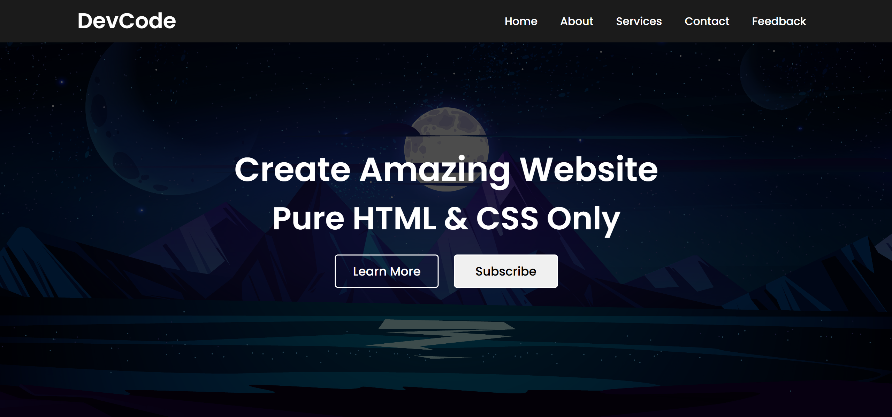

# Simple Website Interface



A basic website interface built using HTML and CSS.

## Features
- Responsive design
- Clean and simple layout
- Basic styling with CSS

## Technologies Used
- HTML
- CSS

## How to Use
1. Clone the repository:
   ```sh
   git clone https://github.com/your-username/repository-name.git
   ```
2. Open the `index.html` file in a web browser.

## License
This project is licensed under the MIT License.
